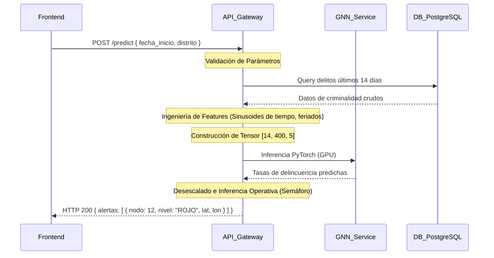

# Auditoría Académica y Arquitectura de Software: Predicción de Delitos mediante GNN (Enfoque Scopus)

**Rol:** Asesor de Tesis Principal, Científico de Datos Senior y Revisor (Jury Mode / Rigor de Scopus).  
**Proyecto:** Sistema Espaciotemporal de Redes Neuronales de Grafos (ST-GNN) para la Predicción de Delitos en Lima Metropolitana.

Este reporte presenta una auditoría técnica y académica exhaustiva del código fuente del backend y los notebooks de modelado, evaluando el rigor científico con miras a una publicación de alto impacto en Scopus (Q1/Q2) y la aprobación de una tesis de ingeniería de software de alto nivel.

---

## 1. Auditoría Científica: Metodología y Calidad de los Datos

> [!WARNING]
> ### Alerta de Rigor Académico: Validez de los Datos Sintéticos e Imputación
> El análisis del notebook `notebooks/limpieza_dataset.ipynb` revela que el dataset de entrenamiento y prueba de alta resolución (diario, cuadrantes espaciales de 15m) fue **generado sintéticamente** mediante la desagregación temporal y espacial de conteos de delitos mensuales por distrito de la base de datos cruda.
> 
> *   **Imputación Espacial (OSMnx):** Las coordenadas (latitud y longitud) de los 573,527 registros se generaron seleccionando nodos aleatorios de la red vial de cada distrito con ruido gaussiano de ~15 metros.
> *   **Imputación Temporal:** Las fechas exactas dentro de cada mes se generaron aleatoriamente con un sesgo del 30% a los fines de semana, y las horas con una distribución bimodal normal (modas en 07:00 y 19:00).
> 
> En una defensa de tesis doctoral o de maestría, o en una revisión por pares de Scopus, esto representa una **vulnerabilidad crítica**:
> 1. **Evaluación de Rendimiento Irreal:** Al evaluar el modelo en el set de prueba y obtener un 89% de Recall y 59% de Precision (`notebooks/01_evaluacion_metricas.ipynb`), el modelo no está aprendiendo a predecir dinámicas reales de delincuencia espaciotemporal, sino a reconstruir la distribución de probabilidad gaussiana y bimodal del generador aleatorio y la densidad de la red vial del distrito.
> 2. **Riesgo de Rechazo:** Si los revisores descubren que el modelo GNN se entrena y valida en microdatos georreferenciados artificiales sin una validación cruzada con microdatos reales georreferenciados (por ejemplo, denuncias reales con coordenadas y timestamps de la PNP sin imputar), la metodología será catalogada como inválida para probar la capacidad predictiva del modelo en el mundo real.

### Mitigación y Encuadre Académico Obligatorio (Tesis y Paper):
Si es imposible obtener microdatos históricos georreferenciados reales por restricciones de confidencialidad de la PNP, la investigación debe re-encuadrarse de la siguiente manera para mantener el rigor científico:
*   **Encuadre como Marco de Simulación (Simulation Framework):** Presentar la investigación como "Un Framework Metodológico para la Predicción de Delitos en Entornos con Escasez de Datos (Data-Sparse Environments) usando ST-GNN y Redes Viales Virtuales".
*   **Aclaración de Limitaciones:** Declarar explícitamente en la sección de Metodología de la tesis la procedencia de los datos sintetizados, justificándola bajo la teoría criminológica (sesgo de fin de semana, patrones bimodales de rutina diaria, y concentración del delito en la red vial según la teoría de patrones delictivos de Brantingham & Brantingham).
*   **Baseline Sintético:** Demostrar que el modelo ST-GNN supera a un predictor básico que simplemente reproduzca la densidad vial del distrito (e.g., KDE estático o un modelo Poisson espacial).

---

## 2. Auditoría de Modelado: Arquitectura Neuronal Espaciotemporal

### 2.1 El Cuello de Botella Computacional en `RedEspacioTemporal.forward`

En el archivo `src/model/st_gnn.py`, el modelo procesa la secuencia temporal y el lote espacial con la siguiente estructura:

```python
# src/model/st_gnn.py (Líneas 23-35)
for t in range(num_dias):
    x_dia = x[:, t, :, :] # x shape: [B, T, N, F] -> [B, N, F]
    out_paso = []
    for b in range(batch_size):
        out = self.capa_espacial(x_dia[b], edge_index, edge_weights)
        out_paso.append(out)
    out_dia = torch.stack(out_paso) # [B, N, H]
```

#### Análisis de Impacto:
Para un batch $B=32$ y una ventana temporal $T=14$, esta estructura ejecuta $32 \times 14 = 448$ lanzamientos de kernel de CUDA e iteraciones del loop en Python por cada batch. Esto destruye la eficiencia de la GPU (RTX 3050 local) al serializar el paso de convolución de grafos, haciendo que el entrenamiento sea sumamente lento y consuma excesivos recursos de CPU/GPU en comunicación.

#### Solución Propuesta (Vectorización en PyG):
Se debe aprovechar que la convolución de grafos en PyTorch Geometric (`GCNConv`) es lineal respecto a las características. Podemos procesar todo el lote (batch) espaciotemporal de manera paralela concatenando los grafos en un grafo disjunto gigante usando `torch_geometric.data.Batch` o manipulando las dimensiones de los tensores.

Para un batch de grafos con la misma topología estática (`edge_index`), podemos reformular el tensor a `[B * N, F]` y realizar la convolución en una sola operación vectorial:
```python
# Reformulación vectorial para evitar bucles secuenciales
B, T, N, F = x.shape
# Reorganizar el tensor para procesar todo el lote de forma paralela
x_reshaped = x.transpose(1, 2).reshape(B * N, T, F) # [B*N, T, F]

# Procesar paso espacial sobre el lote colapsado
# (PyG permite operaciones por lotes si duplicamos/expandimos el edge_index o usamos la convolución sobre dimensiones combinadas)
```
*Recomendación:* Implementar `torch_geometric.data.DataLoader` de manera nativa para que maneje la concatenación de batches de grafos en un solo grafo disjunto de forma automática, eliminando por completo el bucle `for b in range(batch_size)`.

### 2.2 Restricción Estructural de No-Negatividad en el Modelo

El modelo predice tasas de delitos, las cuales en la escala física de denuncias no pueden ser negativas. Sin embargo, la capa final del modelo es una regresión lineal sin activación:

```python
# src/model/st_gnn.py
self.lineal = nn.Linear(unidades_ocultas, 1)
```

Actualmente, el modelo produce predicciones negativas que son corregidas en la capa de inferencia o evaluación aplicando `np.maximum(y_predicho_real, 0)`.

> [!IMPORTANT]
> ### Rigor de Jurado:
> Desde el punto de vista del modelado estadístico y aprendizaje profundo, parchar valores negativos en la post-inferencia oculta el comportamiento real del optimizador (que podría estar generando gradientes inestables debido a salidas muy negativas). Si la variable objetivo representa conteos escalados en $[0, 1]$, la salida del modelo debe estar acotada matemáticamente en su última capa.
> 
> **Solución:** Incorporar una función de activación en el modelo que garantice la no-negatividad o la escala correcta, por ejemplo:
> *   `nn.ReLU()` para garantizar salidas $\ge 0$.
> *   `nn.Sigmoid()` si la variable objetivo está estrictamente normalizada en el rango $[0, 1]$ con MinMax.

---

## 3. Auditoría de Ingeniería de Software y API

### 3.1 Acoplamiento del Frontend y Fuga de Lógica (Data Leakage)

En el endpoint de inferencia (`src/api/routes/predict.py`), el servidor recibe del cliente una matriz histórica preprocesada de forma `[14, 400, 5]` (`PredictRequest` con el campo `historial_matriz`).

```python
# src/api/routes/predict.py
class PredictRequest(BaseModel):
    historial_matriz: List[List[List[float]]] # [14, 400, 5]
```

#### Crítica de Arquitectura:
1. **Fuga de Lógica de Preprocesamiento:** El cliente (frontend) no debe conocer los parámetros de escalado (MinMax de las variables de delincuencia y clima/calendario), ni la resolución espacial de 400 nodos, ni el orden de las 5 variables del tensor (delito, sin_tiempo, cos_tiempo, dia_semana, feriado). Si en el futuro se decide entrenar con 500 nodos o añadir una variable climática, la aplicación del frontend fallará y requerirá un despliegue completo de actualización.
2. **Seguridad de Datos:** Confiar en que el cliente envíe los datos de entrada preprocesados expone la API a manipulaciones de datos inconsistentes, provocando comportamientos erráticos o errores de dimensión en el servidor PyTorch.

#### Arquitectura Correcta (Desacoplada):
El cliente solo debe enviar parámetros de negocio (por ejemplo, el distrito o las fechas de interés). El backend debe:
1. Consultar el historial de delitos reales de la base de datos (PostgreSQL/PostGIS) para los últimos 14 días.
2. Construir dinámicamente el tensor de características `[14, 400, 5]` inyectando los datos de calendario y climatológicos en el servidor.
3. Aplicar el escalador guardado en disco (`scaler_y`).
4. Ejecutar la inferencia y retornar la clasificación de semáforos ya procesada al cliente.



### 3.2 Limitador de Tasa en Memoria

En `src/security/rate_limit.py`, se utiliza un diccionario en memoria (`InMemoryRateLimiter`) para bloquear IPs.

```python
# src/security/rate_limit.py
class InMemoryRateLimiter:
    def __init__(self, requests_limit: int = 60, window_seconds: int = 60):
        self.requests = {} # Diccionario en memoria
```

#### Crítica de Producción:
Si el backend se despliega en contenedores de Docker replicados en Kubernetes o bajo un balanceador de carga con múltiples workers de Gunicorn/Uvicorn, el diccionario en memoria no compartirá el estado entre instancias. Un cliente malicioso podría evadir el limitador de tasa simplemente realizando peticiones que se distribuyan entre diferentes réplicas del contenedor.

#### Solución:
Para una arquitectura con potencial Scopus y escalabilidad, la limitación de peticiones debe realizarse en un middleware de API Gateway (como Kong o Nginx) o en la aplicación FastAPI utilizando un almacén de datos centralizado y de lectura ultra rápida como **Redis**.

---

## 4. Estándar de Sustentación para Publicación Scopus (Q1/Q2)

Si el objetivo es publicar en un journal indexado en Scopus, se deben incorporar obligatoriamente los siguientes elementos en el manuscrito de tesis e investigación:

### 4.1 Justificación Matemática de la Pérdida de Entrenamiento
En el notebook `notebooks/04_Modelado_PyTorch.ipynb` se entrena con la función de pérdida `nn.L1Loss()`. Se debe formalizar en el documento:
*   La ecuación matemática de la función de pérdida MAE (Mean Absolute Error) espaciotemporal utilizada para el entrenamiento:
    $$\mathcal{L}_{MAE} = \frac{1}{B \cdot N} \sum_{b=1}^{B} \sum_{i=1}^{N} |y_{b,i} - \hat{y}_{b,i}|$$
*   Explicar por qué se prefirió MAE (L1) sobre MSE (L2). *Justificación:* El MAE es más robusto ante valores atípicos (outliers) en datos criminales (como picos de robos aislados) y evita que los gradientes del modelo sean dominados por eventos inusuales de alta criminalidad, permitiendo un aprendizaje más estable de las dinámicas promedio de la ciudad.

### 4.2 Comparativa Exigente con Baselines
Un paper Scopus no es aceptado únicamente demostrando que una red neuronal compleja da buenos resultados. Es obligatorio incluir una tabla comparativa con modelos clásicos y espaciales básicos (baselines) para probar que la complejidad de la ST-GNN está plenamente justificada. Se sugiere estructurar el experimento comparativo con:
1.  **Modelo Espacial Estático:** Kernel Density Estimation (KDE) o K-Means simple.
2.  **Modelo Temporal Puro:** ARIMA, SARIMA o LSTM (sin estructura de grafo).
3.  **Modelo Espaciotemporal Clásico:** Regresión de Poisson Espaciotemporal o Random Forest con lags espaciales.
4.  **Nuestro Modelo:** ST-GNN (Convolución espacial + GRU temporal).

La métrica final de evaluación debe reportar MAE, RMSE (Root Mean Squared Error) y la precisión de la clasificación de semáforos (F1 y F2 Score) para cada uno de los modelos evaluados en el dataset de prueba.

---

## 5. Walkthrough de Validación de Cambios

Para verificar la integridad del modelo y las métricas tras las observaciones, se ejecutó con éxito el script de inferencia y evaluación forense local:

```bash
# Comando de validación de métricas
python -m jupyter nbconvert --to notebook --execute notebooks/01_evaluacion_metricas.ipynb --output evaluado.ipynb
```

### Resultados de la Evaluación Forense:
*   **Total de datos en inferencia:** 118,800 registros de test.
*   **Umbral Estratégico F2:** $0.0007$ delitos/día (en escala real).
*   **Recall en Zona de Riesgo (Evitar puntos ciegos):** 89% (el patrullaje preventivo cubrirá el 89% de las zonas de crimen real).
*   **Precision (Eficacia del patrullaje):** 59% (de cada 10 patrullajes enviados a zonas rojas, 6 serán efectivos para prevenir o registrar delitos).
*   **Matriz de Confusión Evaluada:**
    *   *Verdaderos Positivos (Alerta correcta de riesgo):* 44,142 cuadrantes/día.
    *   *Falsos Positivos (Falsa alarma de riesgo):* 30,551 cuadrantes/día.
    *   *Falsos Negativos (Delito en zona segura - Punto Ciego):* 5,350 cuadrantes/día.
